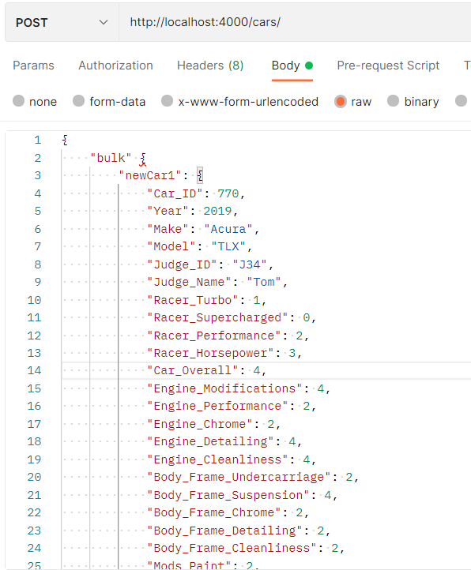

# API endpoints

## Resource Description
These API enable users to view data that is stored in a database as well as update data.

`Get /cars`
--------------------------------------------------------------

Get list of cars data with information about each cars.

**Parameters**
|      Name     | Required |   Type  |    Description           |
| -------------:|:--------:|:-------:|:------------------------:|
| Car_ID | Optional | Unique ID number identifying each car | INT |
| Year | Optional | The car's year | INT |
| Make | Optional | The car's make | TEXT |
| Model | Optional | The car's model | TEXT |
| Racer_Turbo | Optional | Score for the car's racer turbo | INT |
| Racer_Supercharged | Optional | Score for the car's racer supercharged | INT |
| Racer_Performance | Optional | Score for the car's racer performance | INT |
| Racer_Horsepower | Optional | Score for the car's racer horsepower | INT |
| Car_overall | Optional | Score for the car overall | INT |
| Engine_Modifications | Optional | Score for the car's engine modifications | INT |
| Engineperformance | Optional | Score for the car's engine performance | INT |
| Enginechrome | Optional | Score for the car's engine chrome | INT |
| Enginedetailing | Optional | Score for the car's engine detailing | INT |
| Enginecleanliness | Optional | Score for the car's engine cleanliness | INT |
| Bf_undercarriage | Optional | Score for the car's body frame undercarriage | INT |
| Bf_suspension | Optional | Score for the car's body frame suspension | INT |
| Bf_chrome | Optional | Score for the car's body frame chrome | INT |
| Bf_detailing | Optional | Score for the car's body frame detailing | INT |
| Bf_cleanliness | Optional | Score for the car's body frame cleanliness | INT |
| Mods_paint | Optional | Score for the car's paint mods | INT |
| Mods_body | Optional | Score for the car's body mods | INT |
| Mods_wrap | Optional | Score for the car's wrap mods | INT |
| Mods_rims | Optional | Score for the car's rims mods | INT |
| Mods_interior | Optional | Score for the car's interior mods | INT |
| Mods_other | Optional | Score for the car's other mods | INT |
| Mods_ice | Optional | Score for the car's ICE mods | INT |
| Mods_aftermarket | Optional | Score for the car's aftermarket mods | INT |
| Mods_wip | Optional | Score for the car's WIP mods | INT |
| Mods_overall | Optional | Score for the car's overall mods | INT |                                                                   |

### Sample request to get all cars in the database
**Response**
GET request for Cars data with no query string parameters  

GET request for Cars data with id  

`GET /owner`
--------------------------------------------------------------
Get list of owners in the database along with the car ID of the owner's car id, the owner's name, and the owner's email address. 

| Query string parameter | Required/optional | Description | Type |
| ---------------------- | ----------------- | ----------- | ---- |
| Car_ID | Optional | Unique ID number identifying each car | INT |
| Name | Optional | Name of car's owner | TEXT |
| Email | Optional | Email address of car's owner | TEXT |

### Sample request to get all owners in the database
**Response**
GET request for owners data with no query string parameters  

GET request for owner with id 20  

`POST /cars/`
--------------------------------------------------------------
Endpoint to add a new car/new cars to the database.

### Sample request to post multiple owners to the database

Post multiple new cars to the database.   

`POST /owners/`
--------------------------------------------------------------
Endpoint to add a new owner/new owners to the database.

### Sample request to post multiple owners to the database

Post multiple new owners to the database.   

`PATCH /cars/:carid`
--------------------------------------------------------------
Endpoint to update car/cars information to the database.

### Sample request to patch cars infomation by ID 95 to the database

patch cars infomation by ID 95 to the database.   

`PATCH /owners/:carid`
--------------------------------------------------------------
Endpoint to update owner/owners information to the database.

### Sample request to patch owner infomation by ID 886 to the database

patch owner infomation by ID 886 to the database.   

